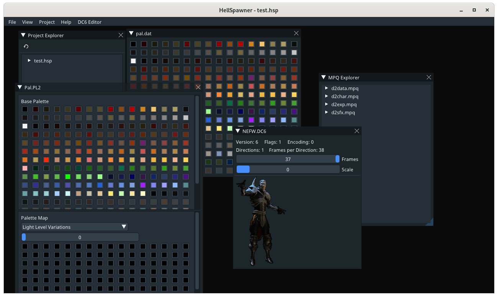
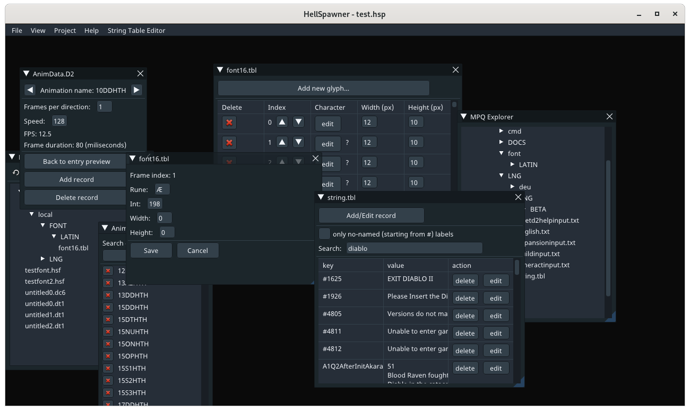
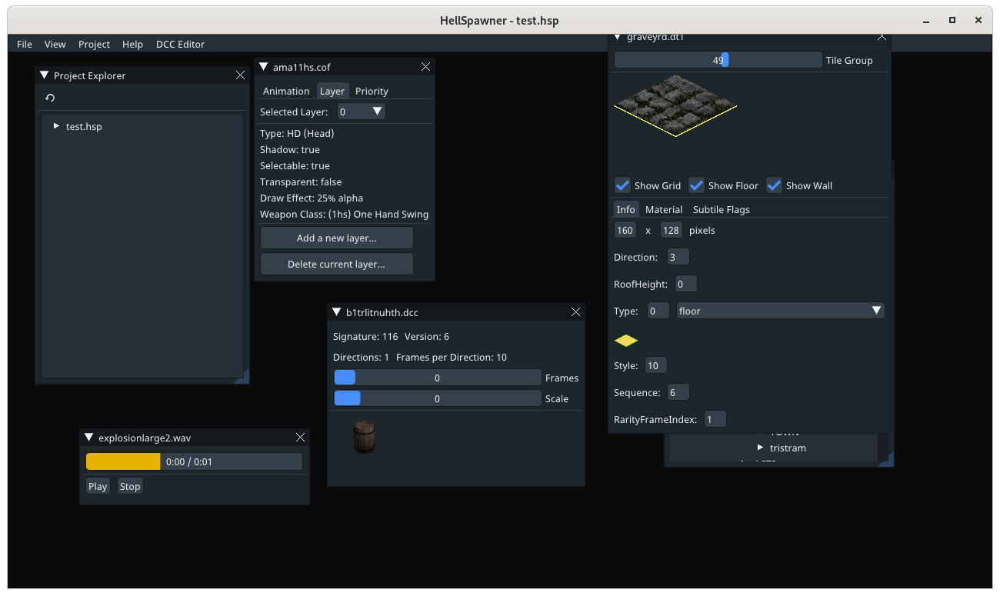

# HellSpawner

[Join us on Discord!](https://discord.gg/pRy8tdc)\
[Join us on IRC!](ircs://irc.libera.chat/#opendiablo2)\
[Development Live stream](https://www.twitch.tv/essial/)\
[Support us on Patreon](https://www.patreon.com/bePatron?u=37261055)

## About this project

HellSpawner is the toolset used for developing games on the [OpenDiablo2](https://github.com/OpenDiablo2/OpenDiablo2) engine.

## Getting the source

To download code use a following command:

`git clone --recurse-submodules https://github.com/OpenDiablo2/hellspawner`

or after pulling the source, download submodules:

`git submodule update --init --recursive`

Then, you need to download go's dependencies:

In root of your project run `go get -d`

Run project by `go run .`

If you're using Unix-based OS, you can build project with included building script: run `./build.sh`

Windows users must have minGW compiler installed (x32 or x64 depending on processor bit capacity and Windows build version) and put path to minGW/bin folder to system PATH variable.

mingw-x64 installer: https://sourceforge.net/projects/mingw-w64/files/latest/download

mingw for x32/x64 installer: https://sourceforge.net/projects/mingw-w64/

See steps 3 and 4 of this [guide](https://code.visualstudio.com/docs/cpp/config-mingw).

## Contributing

If you find something you'd like to fix that's obviously broken, create a branch, commit your code, and submit a pull request. If it's a new or missing feature you'd like to see, add an issue, and be descriptive!

If you'd like to help out and are not quite sure how, you can look through any open issues and tasks, or ask
for tasks on our discord server.

### Lint Errors

We use `golangci-lint` to catch lint errors, and we require all contributors to install and use
it. Installation instructions can be found [here](https://golangci-lint.run/usage/install/).

## VS Code Extensions

The following extensions are recommended for working with this project:

*   ms-vscode.go
*   defaltd.go-coverage-viewer

When you open the workspace for the first time, Visual Studio Code will automatically suggest these extensions for installation.

Alternatively you can get to it by going to settings <kbd>Ctrl+,</kbd>, expanding `Extensions` and selecting `Go configuration`,
then clicking on `Edit in settings.json`. Just paste that section where appropriate.

## Status

For now (start of July 2021) you can use HellSpawner to:

*   create projects
*   browse MPQ archives
*   view following file formats:
    *   DC6  and DCC - animations
    *   WAV - sound files
    *   TXT - data tables
*   edit:
    *   COF - animation data
    *   TBL - font tables
    *   TBL - string tables
    *   TXT - text files
    *   DAT - palettes
    *   PL2 - palette transforms
    *   DT1 - map tiles
    *   DS1 - map preset
    *   D2 - animation data

Much work has been made in the background, but a lot of work still has to be done for the project to be complete.

Feel free to contribute!

## Screenshots

